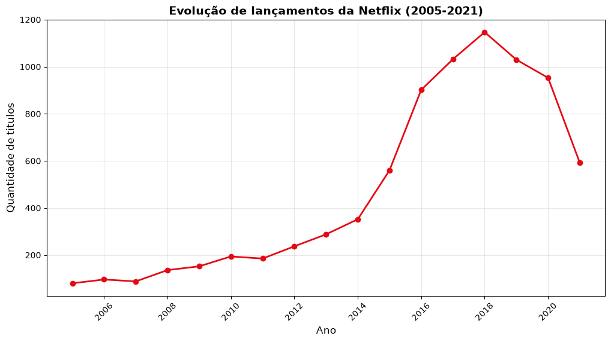

# Analise de Conteudo Netflix

## Visao Geral
Analise do catalogo da Netflix com dados reais (8.800+ titulos)

## Principais Descobertas

### 1. Filmes vs Series
- **Filmes:** 69.9%
- **Series:** 30.1%

### 2. Evolucao de Lancamentos

Crescimento acelerado a partir de 2015

### 3. Top Paises Produtores

1. Estados Unidos
2. India
3. Reino Unido

## Ferramentas
- Python (Pandas, Matplotlib, Seaborn)
- Jupyter Notebook
